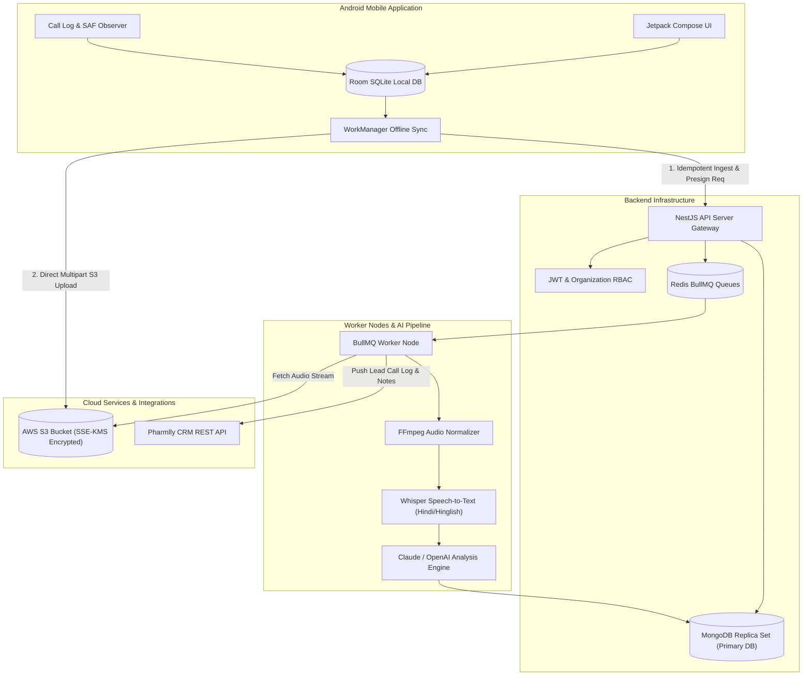
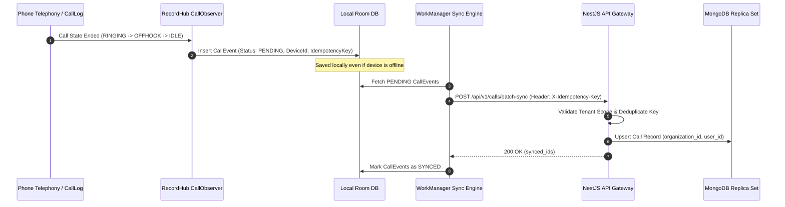
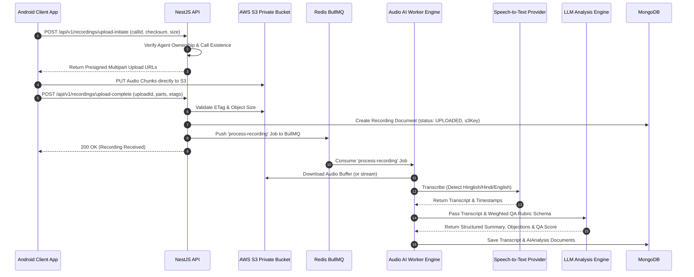
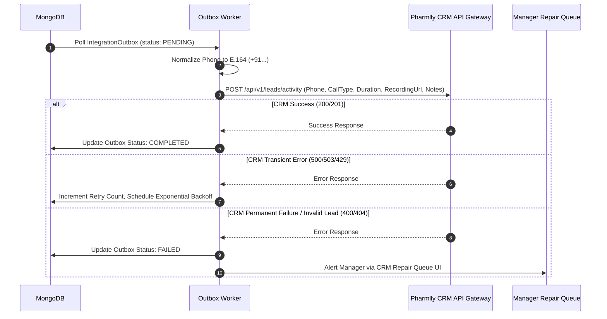

# RecordHub: System Architecture & Design Specification

## System Architecture Overview

RecordHub is structured as a modern monorepo separating frontend, API, background worker, mobile app, shared libraries, and infrastructure configurations.

```
recordhub/
├── apps/
│   ├── web/          # Next.js 14+ Admin & Manager Dashboard (React 18, Tailwind, shadcn/ui, TanStack Query)
│   ├── api/          # NestJS REST API Gateway & Business Logic Services (Mongoose, Passport, OpenAPI 3.1)
│   ├── android/      # Native Kotlin Jetpack Compose Sales Agent Mobile App (Room, WorkManager, Retrofit)
│   └── worker/       # BullMQ Background Worker Node for Audio Normalization, Speech-to-Text & LLM AI Scoring
├── packages/
│   ├── shared/       # Shared TypeScript DTOs, Zod Validation Schemas, Enums & Interfaces
│   ├── ui/           # Shared React UI Component Library
│   └── config/       # Shared ESLint, Prettier, TypeScript & Environment Schemas
├── infra/
│   ├── docker/       # Docker Compose manifests for local dev (MongoDB replica set, Redis, MinIO/LocalStack)
│   └── terraform/    # AWS Provisioning scripts (S3, KMS, ECS, ElastiCache, CloudFront)
└── docs/             # Technical specifications & policy documentation
```

---

## Architecture Diagrams

### 1. Overall System Architecture



---

### 2. Android Call Event Ingestion & Offline Sync Flow



---

### 3. Presigned AWS S3 Upload & Async AI Pipeline Flow



---

### 4. Pharmlly CRM Integration & Outbox Flow


